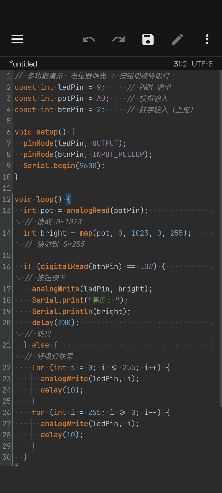
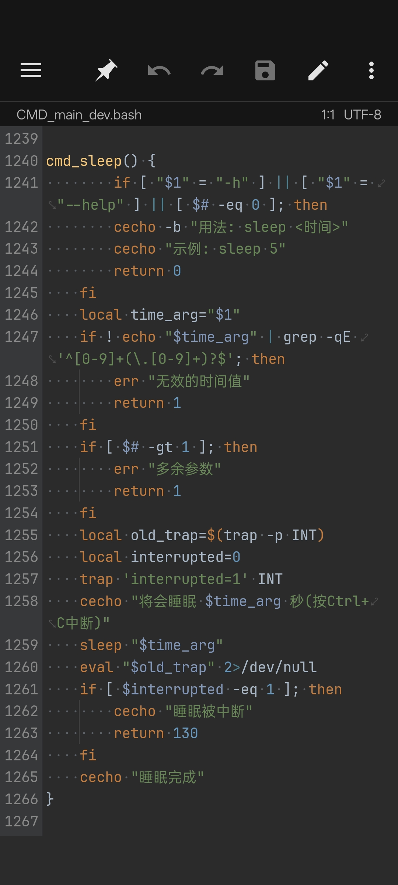
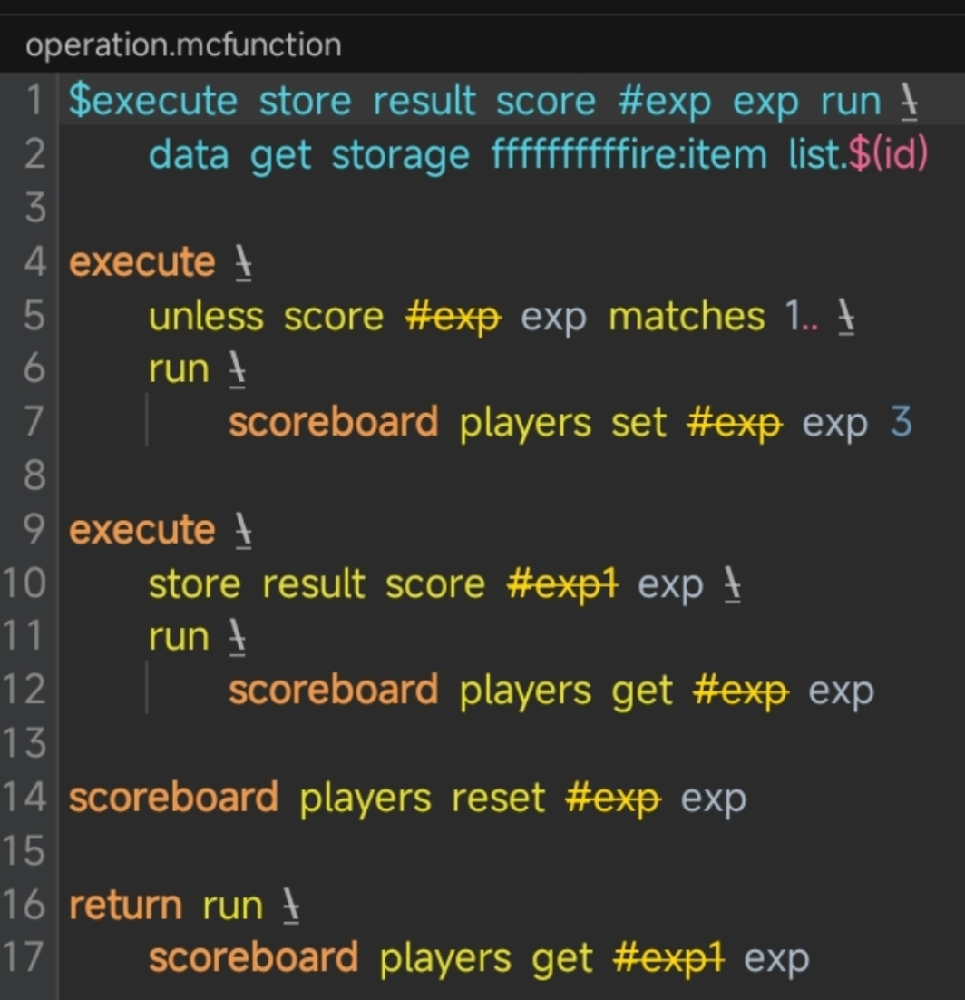
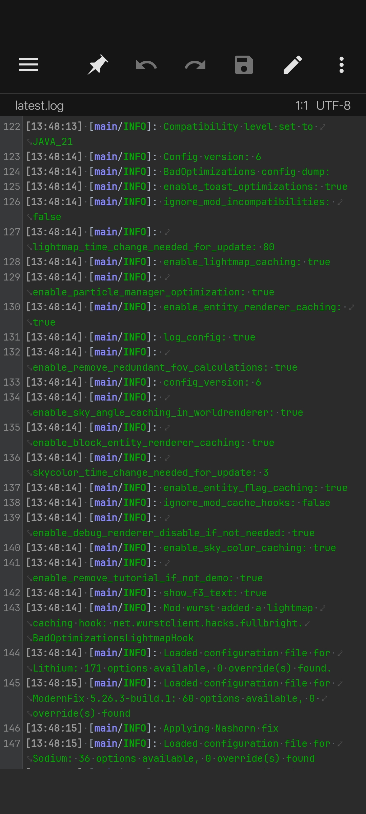
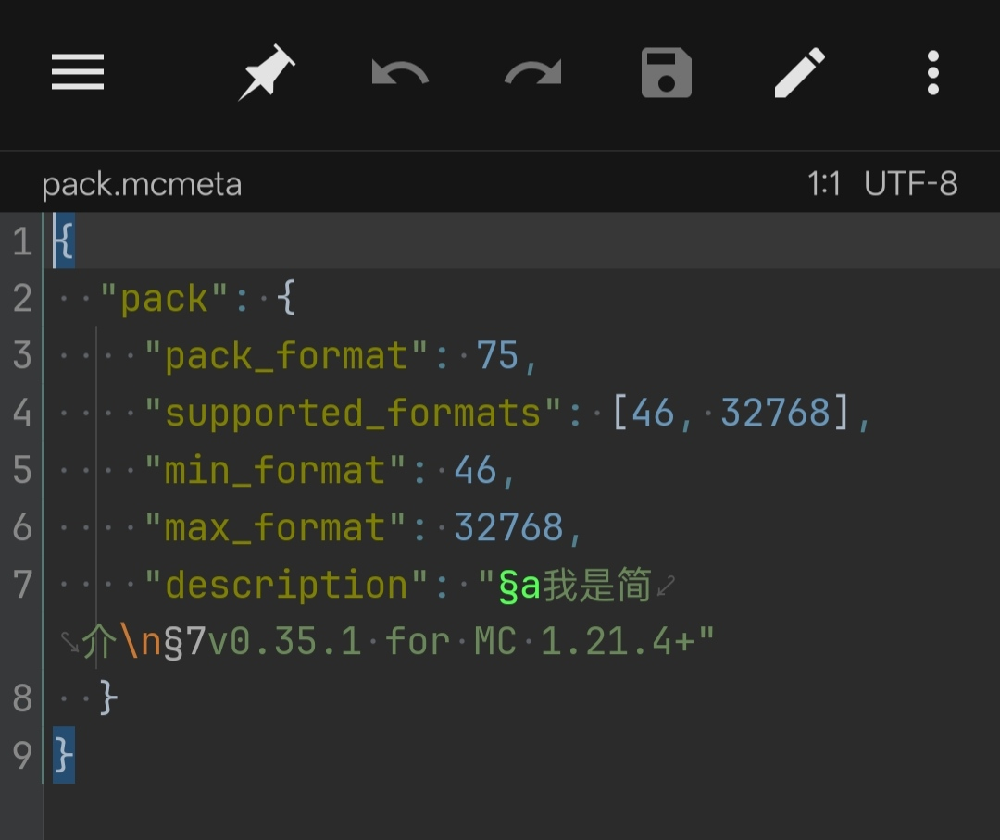

# DC10Xray-MTSX
我自己制作的MT管理器的语法高亮文件(MTSX)

### 📦 包含文件

| 文件 | 对应语言 | 预览图 |
| :--- | :--- | :--- |
| `Arduino.mtsx` | Arduino (.ino) |  |
| `bash.mtsx` | Bash (.bash) |  |
| `mcfunction.mtsx` | Minecraft JE 1.21+ Function (.mcfunction/.mc) |  |
| `mclog.mtsx` | Minecraft JE(客户端服务端通用)日志 (.log) |  |
| `Mcmeta.mtsx` | Minecraft Metadata(资源包或数据包元数据) (.mcmeta) |  |

### 📂 怎么用?
1. 在源代码下载.mtsx文件或在发行下载(详见发行)
2. 直接在MT里点击下载的.mtsx, 点击安装即可

### 纯手工整理，有些地方可能有些许偏差，凑合用。

### 📜 许可证
MIT License

Copyright (c) 2026 DC10Xray
